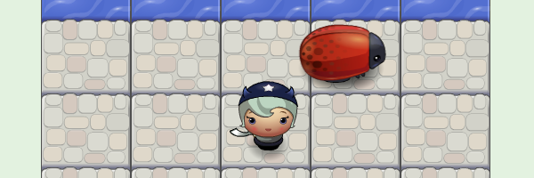

  

<h1 align="center">
  Game "Frogger"
</h1>

  
  
  

  <a href="https://ik-web.github.io/game-frogger/">
    [> DEMO LINK <]
  </a> 

## Description:

The mini browser game is written in a third-party engine.

## Documentation

**Instructions:**
- You need to move the character to the top point of the play area, to any cell designated as water. When you complete this task, your level will increase by 1.
- If you step on a cockroach, the game is lost and you have to start over ...
- To win, you need to reach the maximum level (currently it is 12th).
**Good luck to you!**

**Control:**
- Buttun ↑ 'Up'    - step to up
- Buttun ↓ 'Down'  - step to down
- Buttun ← 'Left'  - step to left
- Buttun → 'Right' - step to Right

## Developers

- [Ihor Kuchin](https://github.com/ik-web)

## License

>MIT License
>
>Copyright (c) 2022 Ihor Kuchin
>
>Permission is hereby granted, free of charge, to any person obtaining a copy
>of this software and associated documentation files (the "Software"), to deal
>in the Software without restriction, including without limitation the rights
>to use, copy, modify, merge, publish, distribute, sublicense, and/or sell
>copies of the Software, and to permit persons to whom the Software is
>furnished to do so, subject to the following conditions:
>
>The above copyright notice and this permission notice shall be included in all
>copies or substantial portions of the Software.
